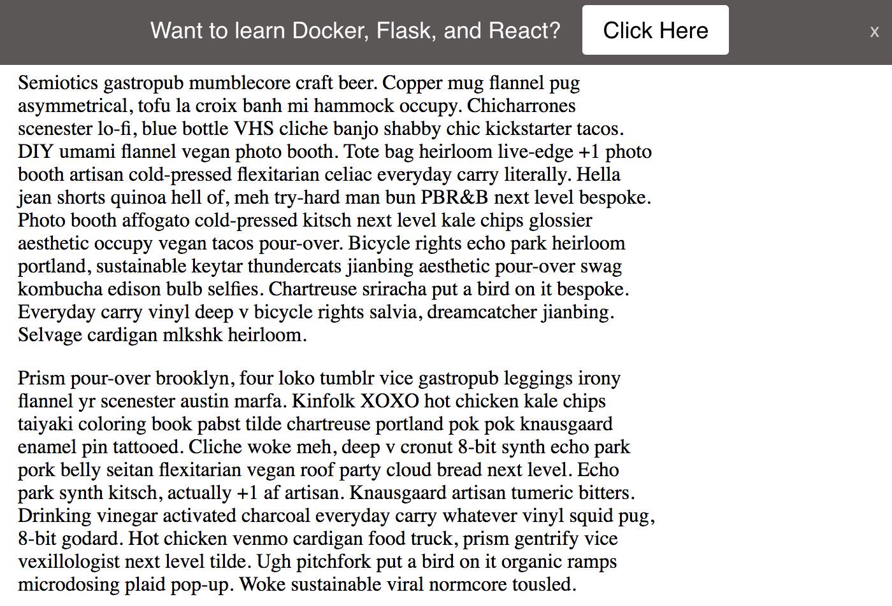

# Hello Bar

Just a simple notification bar, similar to [Hello Bar](https://www.hellobar.com/).

## Getting Started

1. Update the `content` object in *hello.js*. Check out [sample-text.md](sample-text.md) for some ideas on what to display.
1. Update the media query in *hello.css*, if you want the bar to be displayed on mobile devices
1. Add *hello.css* and *hello.js* into your project

> If you decide to send the button click info to Google Analytics, then the "JavaScript tracking snippet" must be already set up on your site. See
[Adding analytics.js to Your Site](https://developers.google.com/analytics/devguides/collection/analyticsjs/) for more info.

## Example

